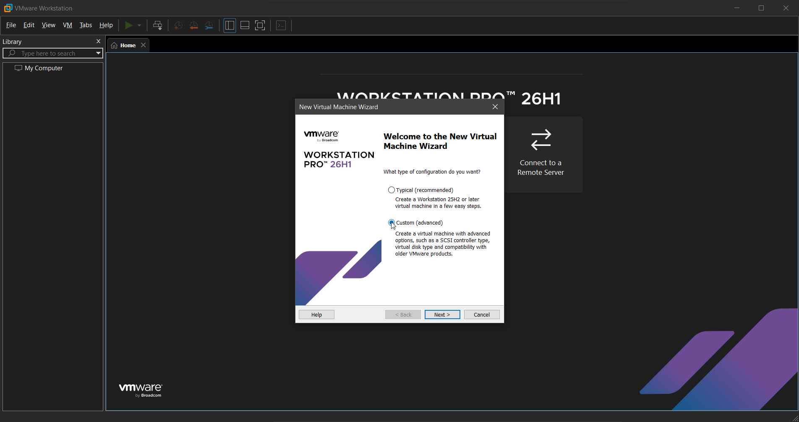
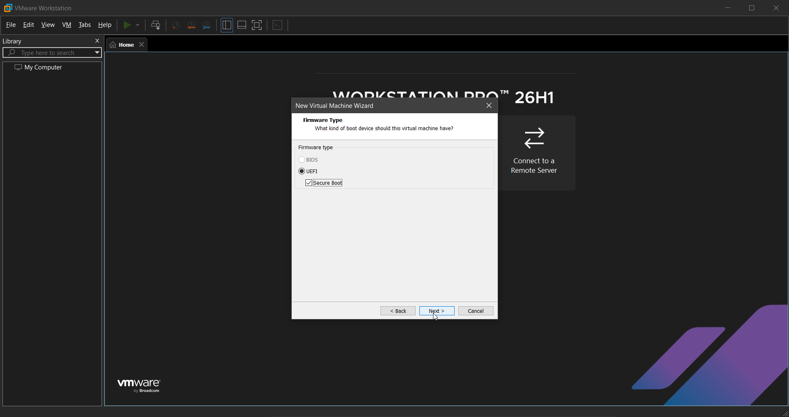
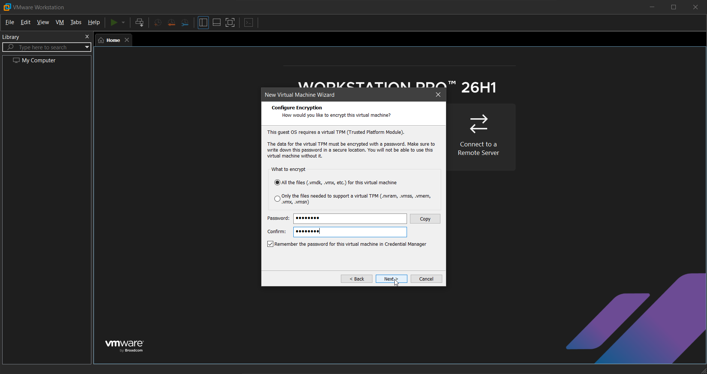
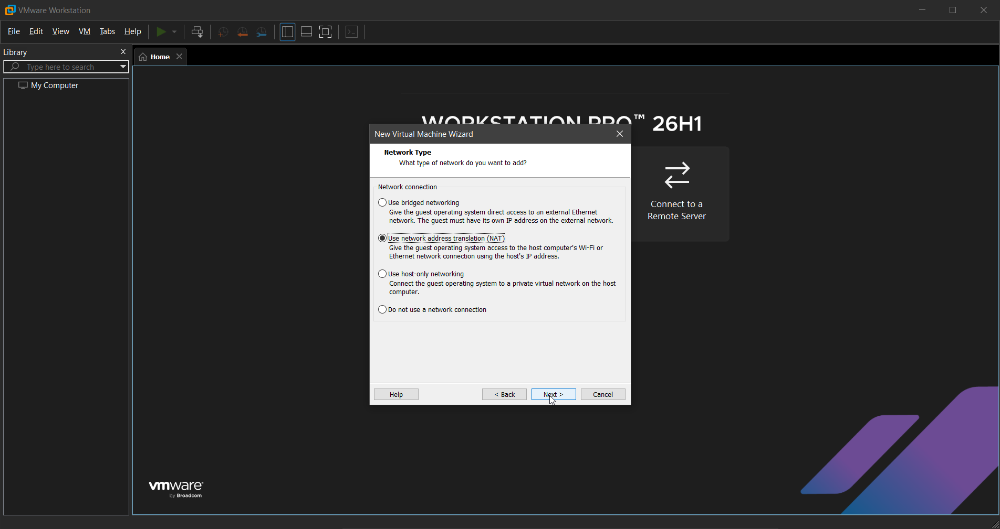
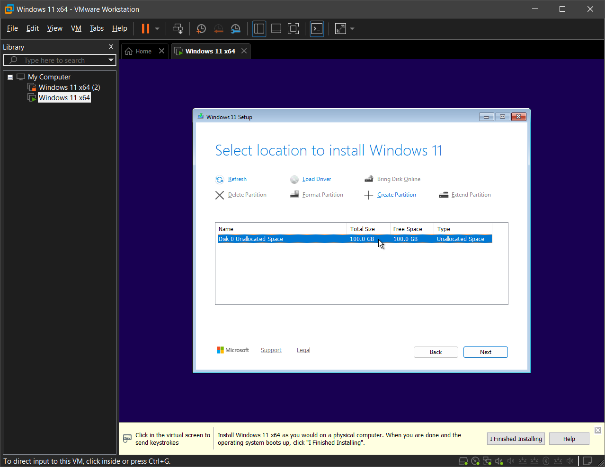
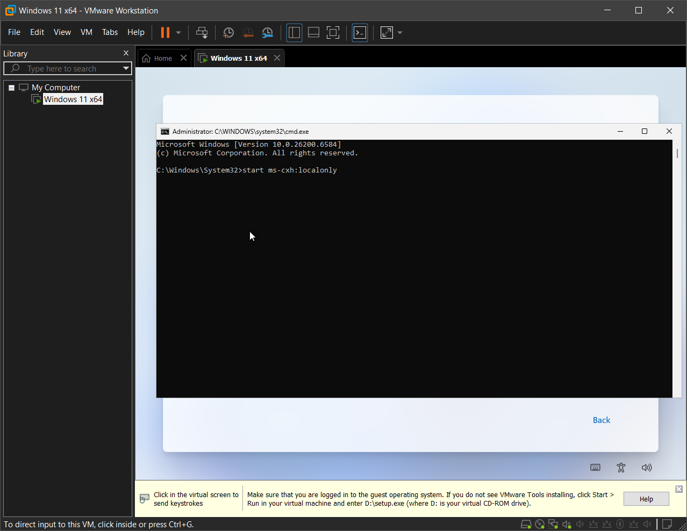
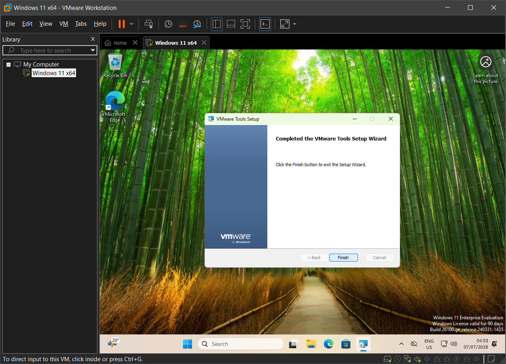
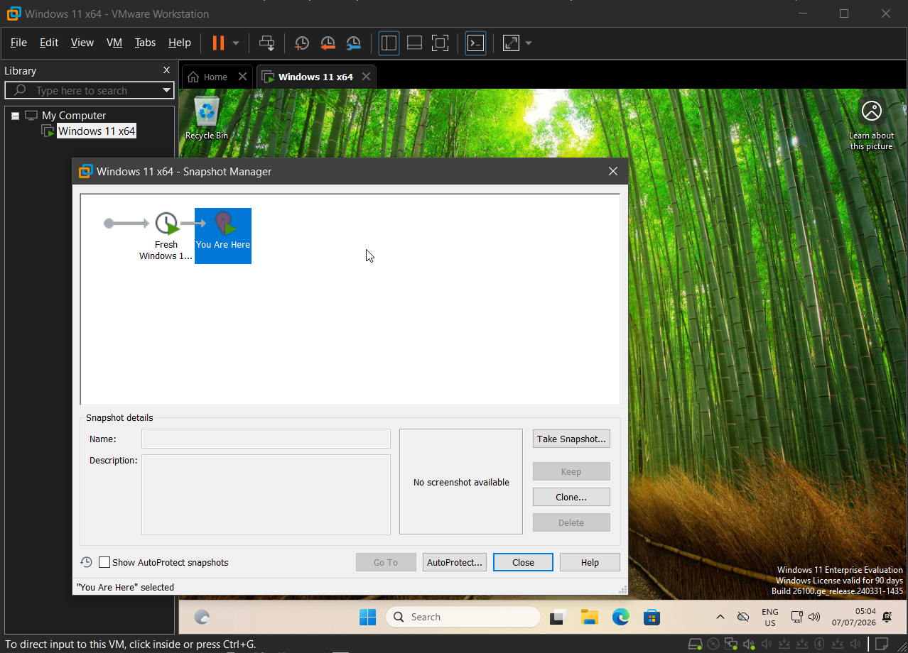
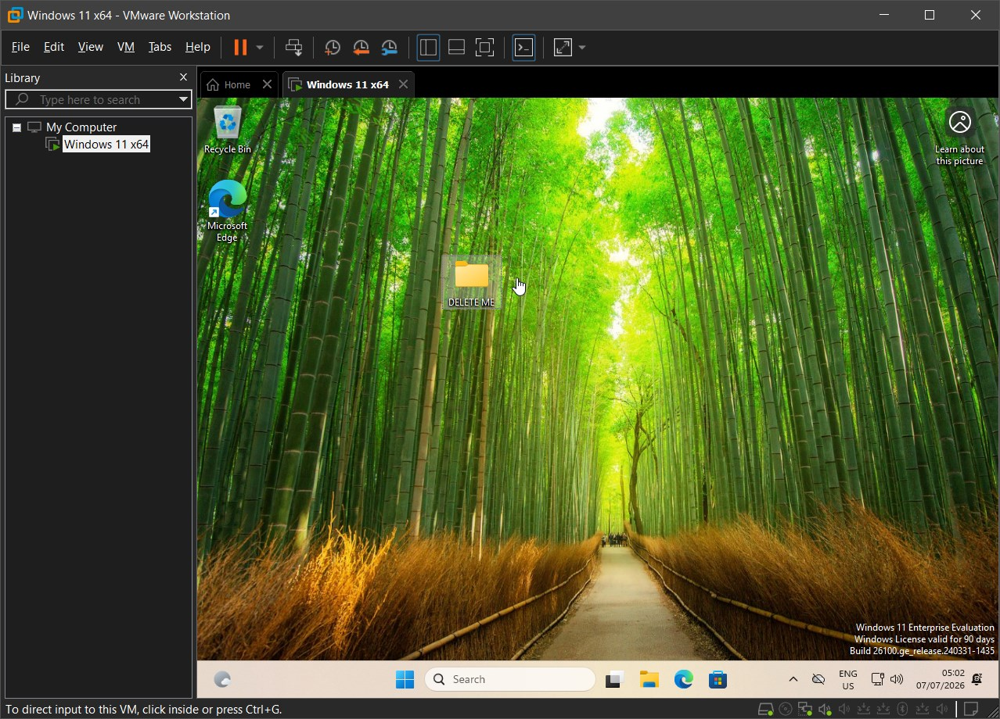
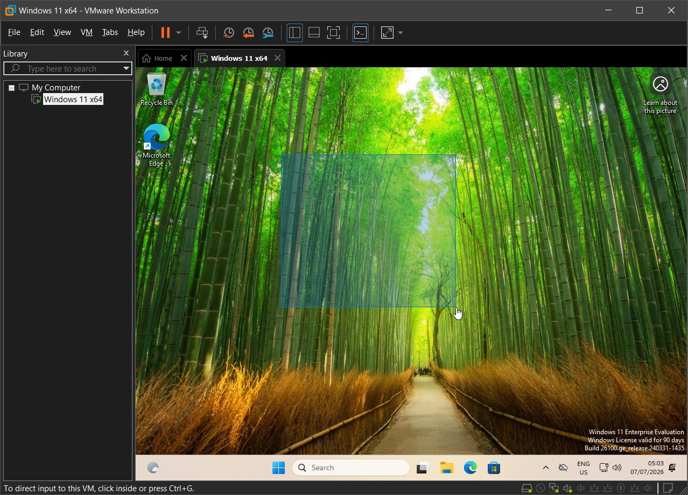

# Windows 11 VM Setup & Snapshots

## Scenario

A Windows 11 virtual machine (VM) was required as a controlled environment for future IT labs. The goal was to install a functional system in VMware Workstation Pro, manually configure the virtual hardware, set up a local account, create a baseline snapshot, and verify that the system could be restored after unwanted configuration changes.

## Environment

- **Guest operating system:** Windows 11 Enterprise Evaluation
- **Hypervisor:** VMware Workstation Pro 26H1
- **Installation media:** Windows 11 ISO
- **Host operating system:** Windows 10

## VM Configuration

- **Memory:** 16 GB
- **Processors:** 1 processor, 4 cores
- **Storage:** 100 GB virtual disk
- **Disk type:** NVMe
- **Network type:** NAT
- **Firmware:** UEFI with Secure Boot
- **Virtual TPM:** Enabled
- **Snapshot name:** `Fresh Windows 11 install`

## Skills Demonstrated

- Windows 11 VM setup
- VM hardware configuration
- Local Windows account setup
- VMware Tools installation
- Snapshot management

## Implementation

### 1. Created and configured the virtual machine

A Windows 11 VM was created in VMware Workstation Pro using the Custom (advanced) configuration option. This allowed manual configuration of the virtual hardware, including memory, CPU cores, disk settings, and network type.



The VM was configured with UEFI firmware and Secure Boot enabled to support the Windows 11 installation requirements. UEFI is the modern replacement for legacy BIOS and is responsible for initializing the system hardware and starting the boot process. Secure Boot helps ensure that trusted boot components are used during startup.



In addition to UEFI and Secure Boot, Windows 11 also requires TPM 2.0 (Trusted Platform Module), which provides hardware-based security functions, including secure storage for cryptographic keys and support for features such as BitLocker.



### 2. Configured virtual hardware resources

The VM was assigned 16 GB of RAM to ensure smooth Windows 11 performance while leaving resources available for the host system.


The VM network type was set to NAT (Network Address Translation). This allows internet access through the host computer without making the VM appear as a separate device on the physical network.



### 3. Installed Windows 11

Disk 0 was selected as the installation target.

Since the disk was left unallocated, Windows Setup could create the required partitions automatically.



### 4. Created a local Windows account

To complete the Windows 11 installation, a Microsoft account sign-in was required. Since this VM was intended for lab use, `start ms-cxh:localonly` was run from Command Prompt to open the local account setup flow and create a local user account named `Stanic` instead.

This kept the VM separated from personal cloud services and made it easier to reset and reuse.



### 5. Installed VMware Tools

With Windows 11 now operational, VMware Tools were installed next.

VMware Tools improve display scaling, mouse movement, clipboard behavior, and general integration between the host and guest systems.



### 6. Created a baseline snapshot

To complete the VM setup, a baseline snapshot named  `Fresh Windows 11 install` was created.

This snapshot provides a known working state that can be restored to before starting future labs or after making unwanted configuration changes.



### 7. Verified snapshot restore

A temporary folder named `DELETE ME` was created before reverting the VM to the baseline snapshot.



After the revert, the folder was no longer present, confirming a successful rollback.



## Result

The Windows 11 VM environment was deployed in VMware Workstation Pro. VMware Tools were installed, and the required manual configuration was completed.

With the baseline snapshot created and tested, the environment is now ready for future IT labs.

## Troubleshooting

### Windows 11 setup required a Microsoft account

- **Symptoms:** During Windows 11 setup, the installer required a Microsoft account sign-in.
- **Cause:** Windows 11 OOBE encourages or requires Microsoft account login during setup.
- **Resolution:** I opened Command Prompt during setup and ran:

```cmd
start ms-cxh:localonly
```

[← Return to Windows](../)