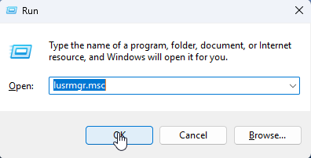
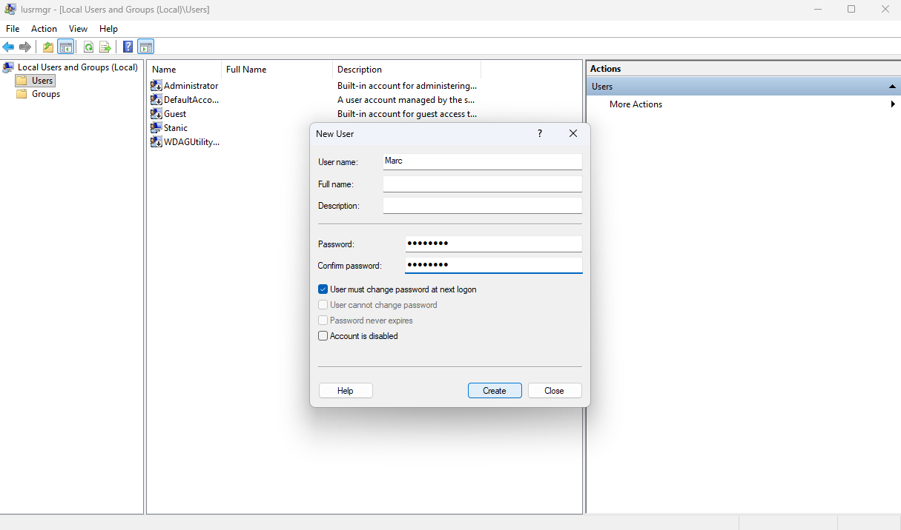
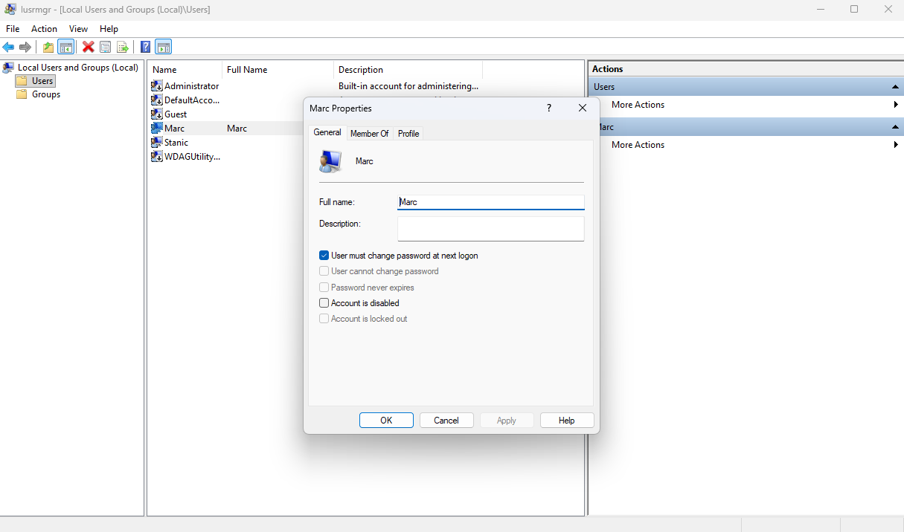
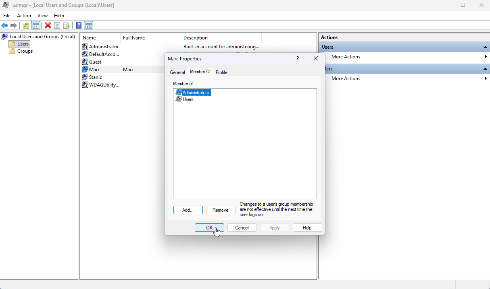
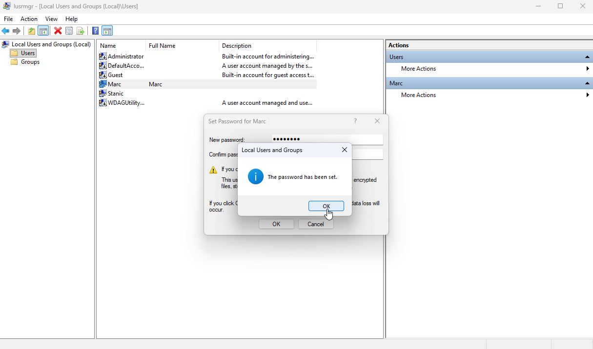
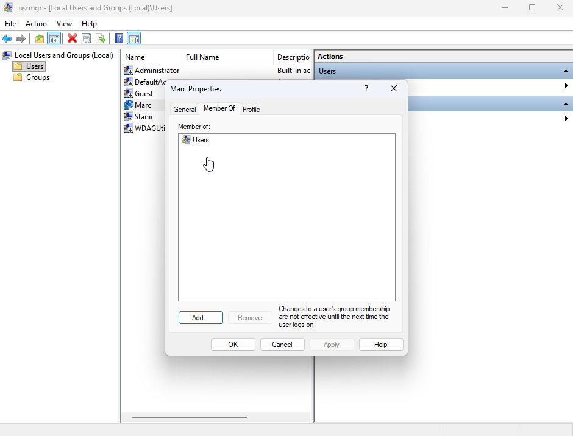
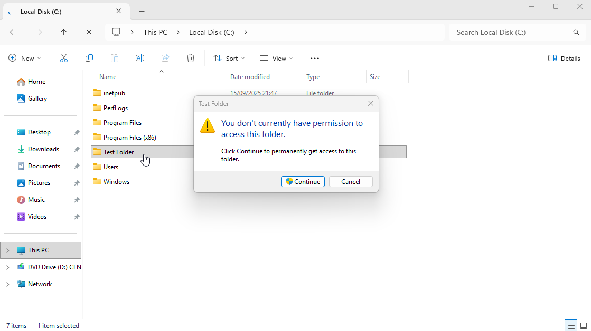
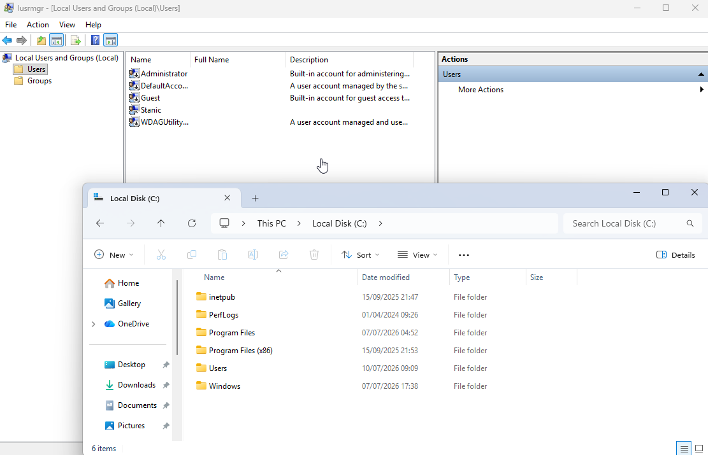

# Local User Accounts & File Permissions

## Scenario

A temporary local user account and a test folder were required to practice user administration and NTFS permission management. The goal was to create a temporary user, modify group membership, perform a password reset, configure NTFS permissions, verify folder access, and remove the temporary resources after testing.

## Environment

- **Operating system:** Windows 11 Enterprise Evaluation
- **Administration tool:** Local Users and Groups (`lusrmgr.msc`)

## Skills Demonstrated

- Local user account creation and deletion
- Group membership management
- Password reset
- Permission inheritance management
- NTFS permission configuration

## Implementation

### 1. Opened Local Users and Groups

Local user accounts can be administered through several Windows tools, including **Settings**, **Control Panel**, and **Local Users and Groups**. For this lab, **Local Users and Groups** was used because it provides direct access to local users, account properties, and group memberships. The tool was opened by entering `lusrmgr.msc` in the Run dialog.

### 2. Created and verified a local user account

A temporary local user account named `Marc` was created. The account was configured to require a password change at the next logon, allowing the user to set their own password privately.

After creation, the `Marc` account appeared in the local users list, verifying that it had been created.

### 3. Added the user to the Administrators group

The `Marc` account was added to the local `Administrators` group while retaining its default `Users` group membership, granting the account elevated privileges.

### 4. Reset the local user password and removed administrator privileges

The password for the `Marc` account was reset to simulate a forgotten-password request, a common IT support scenario.

Before proceeding, `Marc` was removed from the `Administrators` group so that the elevated privileges would not affect the permission test.

### 5. Created a test folder

A folder named `Test Folder` was created on the `C:` drive for NTFS permission testing.

### 6. Disabled inheritance and configured explicit NTFS permissions

Permission inheritance was disabled so the folder could be configured with explicit NTFS permissions.

After the inherited permission entries were removed, an explicit permission entry was configured for `Stanic`, the existing local account created during the previous **Windows 11 VM Setup & Snapshots** lab.

### 7. Verified folder access

The `Stanic` account was able to access the `Test Folder`.

By contrast, the `Marc` account was denied access, confirming that the NTFS permissions were applied correctly.

### 8. Removed temporary user account and test folder

After the administration and permission tests were completed, the temporary `Marc` account and `Test Folder` were deleted.

## Result

The local user account `Marc` was created, temporarily granted local administrator privileges, and used to simulate a forgotten-password request. NTFS permissions were then configured on a test folder to control user access.

Testing confirmed that `Stanic` could access the folder while `Marc` was denied access. The temporary account and test folder were deleted after access was verified.

[← Return to Windows](../)