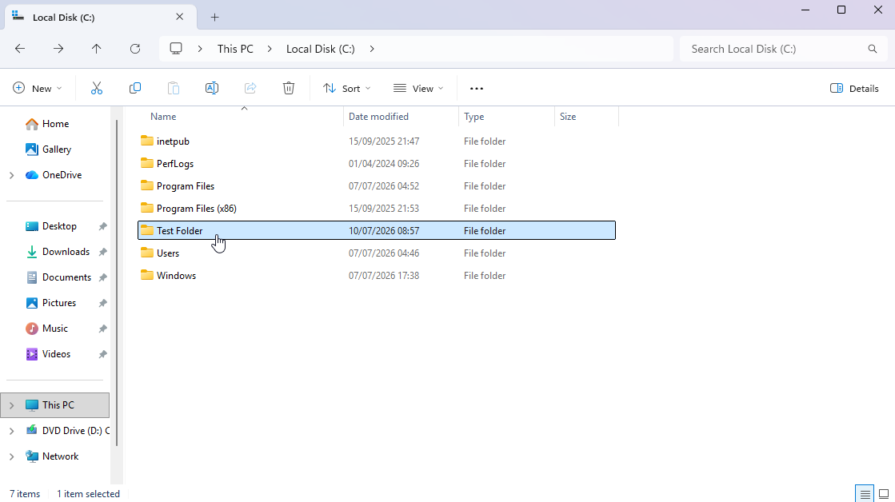
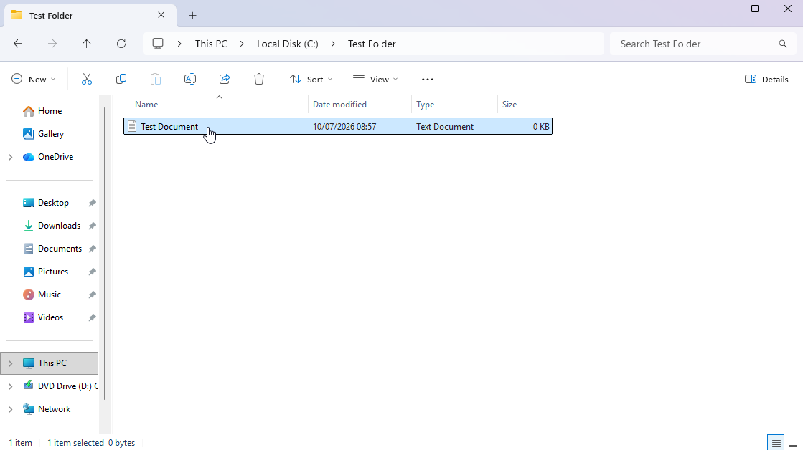
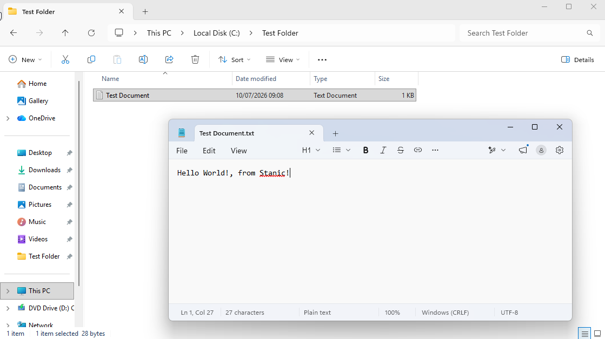

# Local User Accounts & File Permissions

## Scenario

A local Windows user account needed to be created and managed as part of a basic IT support workflow. The goal was to create a test user, modify group membership, perform a password reset, and remove the temporary account after testing.

Local user accounts can be administered through several Windows tools, including **Settings**, **Control Panel**, and **Local Users and Groups**. For this lab, `lusrmgr.msc` was used because it provides a more efficient interface for managing local users and group memberships.

## Environment

- **Operating system:** Windows 11 Enterprise Evaluation
- **Account type:** Local Windows user account
- **Administration tool:** Local Users and Groups (`lusrmgr.msc`)

## Skills Demonstrated

- Local user account creation
- Local group membership management
- Password reset 
- Local user account deletion

## Implementation

#### 1. Opened Local Users and Groups

The **Local Users and Groups** console was opened by running `lusrmgr.msc`.

### 2. Created a local user account

A temporary test account named `Marc` was created. The account was configured to require a password change at the next logon. This way we can assure the user will have full autonomy on his log-in credentials without anyone else knowing it.

### 3. Verified the new user account

After creation, the new account appeared in the local users list. To make sure everything was configured correctly, the account's properties were reviewed.

### 4. Added the user to the Administrators group

For demonstration purposes, the test account was added to the local `Administrators` group while retaining its default `Users` group membership. This enabled the ability to perform administrative tasks on this local machine. 

### 5. Reset the local user password

The password for the test account was reset to simulate a common IT support task.

### 6. Removed the temporary user account

After the account administration tasks were completed, the temporary test account was deleted.

### 7. Created a test folder

A folder named `Test Folder` was created on the local disk for NTFS permission testing.

### 8. Created a test document

A document named `Test Document` was created inside the folder to verify file access after permissions were changed.

### 9. Disabled inherited permissions

Permission inheritance was disabled so the folder could be configured with explicit NTFS permissions.

### 10. Configured explicit folder permissions

Inherited permission entries were removed, leaving only the intended local account with access to the folder.

### 11. Verified allowed access

The allowed account was able to open and edit the test document.

### 12. Verified denied access

The restricted test account was unable to access the folder, confirming that the NTFS permissions were applied correctly.

### 12. Removed temporary user account and test folder

After the local account administration and NTFS permission testing was completed, the temporary user account `Marc` and the `Test Folder` directory were deleted. This also removed the test document created inside the folder.

## Result

The local user account `Marc` was successfully created, assigned local administrator privileges, used for a password reset demonstration, and removed after testing. This demonstrated a basic local user account administration workflow.

Adding a user to the local `Administrators` group grants elevated privileges on the machine. In a real environment, local administrator access should only be granted when required, as unnecessary administrator privileges can create security risks.

[← Return to Windows](../)