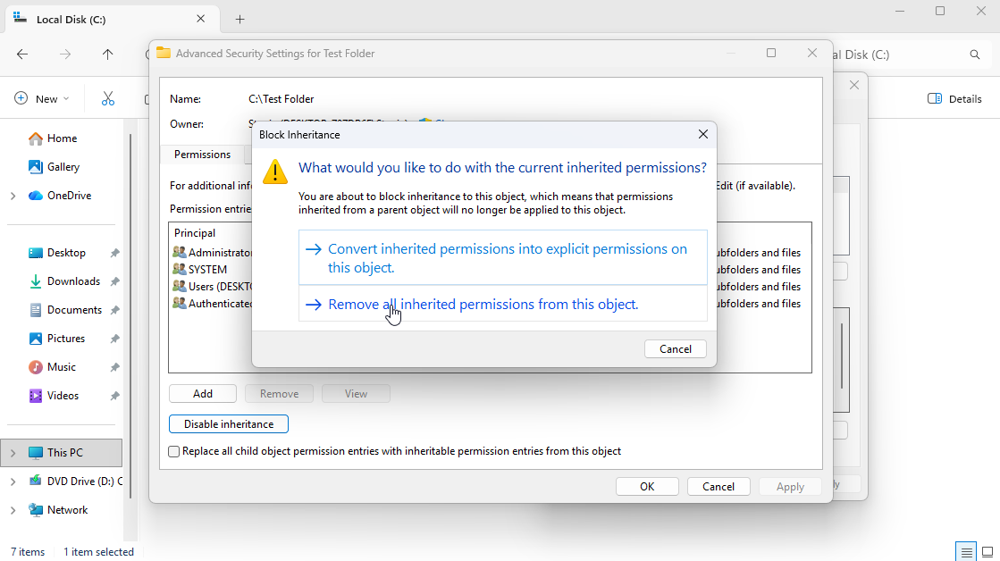
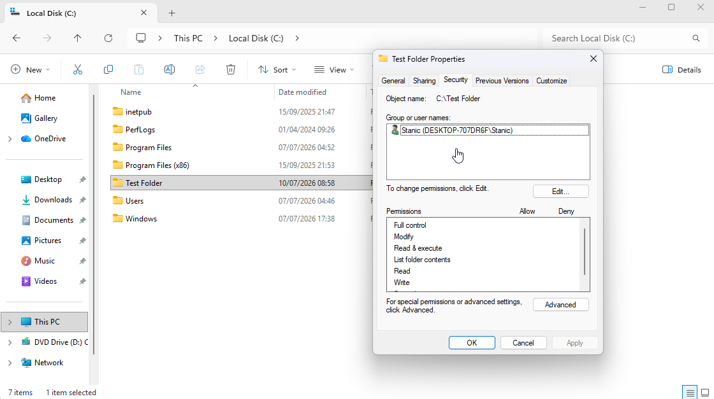
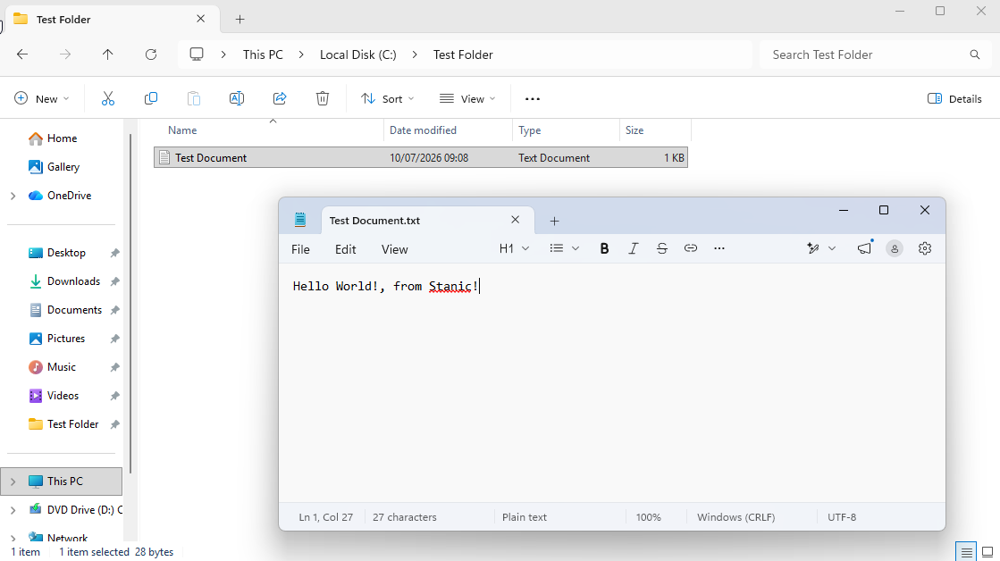

# Local User Accounts & File Permissions

## Scenario

A temporary local user account and a test folder were required to practice user administration and NTFS permission management in Windows 11. The goal was to create a temporary user, modify group membership, perform a password reset, configure NTFS permissions, verify folder access, and remove the temporary resources after testing.

Local user accounts can be administered through several Windows tools, including **Settings**, **Control Panel**, and **Local Users and Groups**. For this lab, `lusrmgr.msc` was used because it provides a more efficient interface for managing local users and group memberships.

## Environment

- **Operating system:** Windows 11 Enterprise Evaluation
- **Administration tool:** Local Users and Groups (`lusrmgr.msc`)

## Skills Demonstrated

- User creation and deletion
- Group membership management
- Password reset 
- NTFS permission configuration
- Permission inheritance management

## Implementation

### 1. Opened Local Users and Groups

The **Local Users and Groups** was opened by running `lusrmgr.msc`.

### 2. Created a local user account

A temporary local user account named `Marc` was created. The account was configured to require a password change at the next logon, allowing the user to set their own password privately.

### 3. Verified the new user account

The new account appeared in the local users list, verifying that it had been created.

### 4. Added the user to the Administrators group

The test account was added to the local `Administrators` group while retaining its default `Users` group membership. This granted the account local administrator privileges.

### 5. Reset the local user password

The password for the test account was reset to simulate a forgotten-password request, a common IT support scenario.

### 6. Created a test folder

A folder named `Test Folder` was created on the `C:` drive for NTFS permission testing.

### 7. Disabled inherited permissions

Permission inheritance was disabled so the folder could be configured with explicit NTFS permissions.

### 8. Configured explicit folder permissions

Inherited permission entries were removed, leaving only the intended local account with access to the folder.

### 9. Verified allowed access

The allowed account was able to open and edit the test document.

### 10. Verified denied access

The restricted test account was unable to access the folder, confirming that the NTFS permissions were applied correctly.

### 11. Removed temporary user account and test folder

After the local account administration and NTFS permission testing was completed, the temporary user account `Marc` and the `Test Folder` directory were deleted.

## Result

The local user account `Marc` was created, assigned local administrator privileges, and used to simulate a password reset scenario. NTFS permissions were then configured on a test folder to control user access. Testing confirmed that `Stanic` could access the folder, including the document inside it, while `Marc` was denied access.

After the workflow was completed, the temporary user account and test folder were deleted.

## Note

Adding a user to the local `Administrators` group grants elevated privileges on the machine. In a real environment, this should be approached with caution, as unnecessary privileges can create security risks.

[← Return to Windows](../)