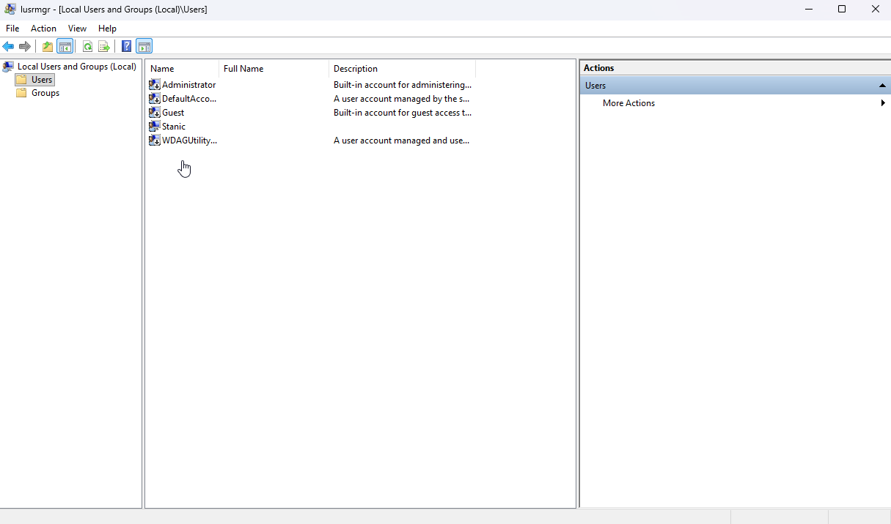

# Local User Account Administration

## Scenario

A local Windows user account needed to be created and managed as part of a basic IT support workflow. The goal was to create a test user, modify group membership, perform a password reset, and remove the temporary account after testing.

Local user accounts can be administered through several Windows tools, including **Settings**, **Control Panel**, and **Local Users and Groups**. For this lab, `lusrmgr.msc` was used because it provides a more efficient interface for managing local users and group membership.

## Environment

- **Operating system:** Windows 11 Enterprise Evaluation
- **Account type:** Local Windows user account
- **Administration tool:** Local Users and Groups (`lusrmgr.msc`)

## Skills Demonstrated

- Local user account creation
- Local user property management
- Local group membership management
- Password reset workflow
- Local user account deletion
- Use of `lusrmgr.msc` for local account administration

## Implementation

### 1. Opened Local Users and Groups

The **Local Users and Groups** console was opened by running `lusrmgr.msc`.

### 2. Created a local user account

A temporary test account named `Marc` was created. The account was configured to require a password change at the next logon.

### 3. Verified the new user account

After creation, the new account appeared in the local users list. The account properties were reviewed to confirm the configuration.

### 4. Added the user to the Administrators group

For demonstration purposes, the test account was added to the local `Administrators` group while retaining its default `Users` group membership.

### 5. Reset the local user password

The password for the test account was reset to simulate a common IT support task.

### 6. Removed the temporary user account

After the account administration tasks were completed, the temporary test account was removed from the system.

## Result

A local Windows user account was created, reviewed, added to the local `Administrators` group, and used to demonstrate a password reset workflow.

After testing was complete, the temporary account was removed, returning the local user list to its previous state.

## Notes

The local user account named `Marc` was successfully created, given administrator privileges, performed a password reset for and removed, successfully demonstratiing a basic local user account management workflow. 

Adding a user to the local `Administrators` group grants elevated privileges on the machine. In a real environment, this should be done with caution and only when required, as it poses a large security escalated privilege threat. 

[← Return to Windows](../)