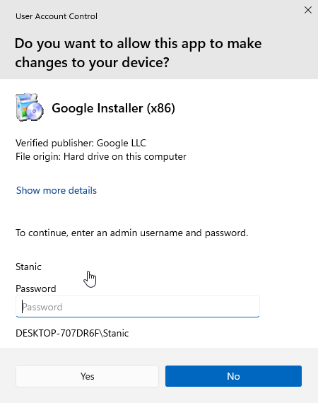
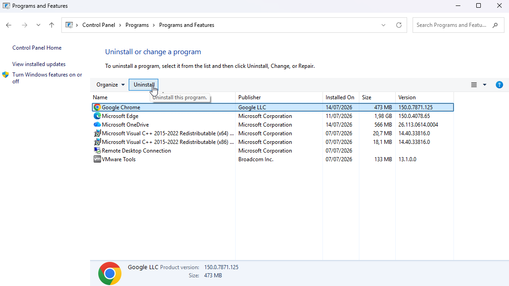
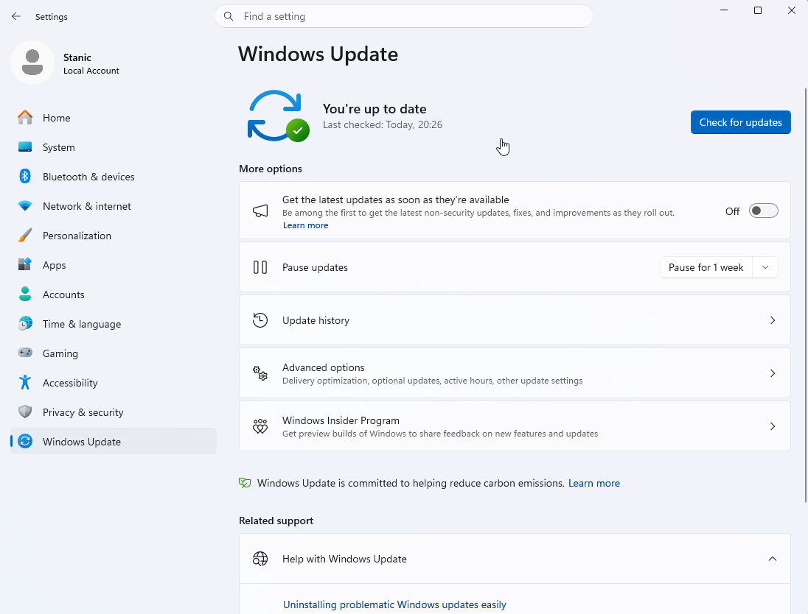
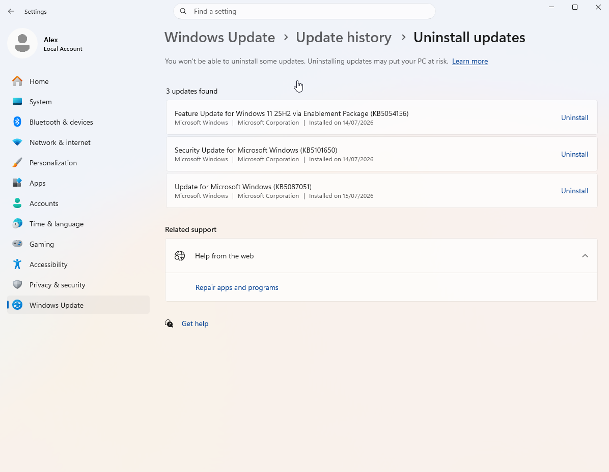

# System Maintenance

## Scenario

A local user account with standard privileges was required to practice software management and operating system maintenance. The goal was to install and uninstall an application, check for, install, and uninstall a Windows update, verify when administrator authorization was required through User Account Control (UAC), and review the update history and advanced options.

## Environment

- **Operating system:** Windows 11 Enterprise Evaluation
- **Local user account:** `Alex`
- **Administrator account:** `Stanic`
- **Test application:** Google Chrome
- **Administration tools:** Windows Settings and Control Panel

## Skills Demonstrated

- Standard user privilege testing
- Software installation and uninstallation
- User Account Control (UAC)
- Windows Update management
- Update history and advanced options review

## Implementation

### 1. Created a local user account with standard privileges

A local user account named `Alex` was created with standard privileges. This provided an account for verifying which software and operating system maintenance tasks required administrator authorization.

### 2. Installed and verified Google Chrome

While signed in to `Alex`, the Google Chrome installer was opened. Since the installation required elevated privileges, User Account Control requested an administrator username and password. Credentials for `Stanic`, the existing administrator account, were used to continue.

After authorization was provided, Google Chrome was installed and opened to verify that the application was operational.

### 3. Uninstalled and verified the removal of Google Chrome

Google Chrome was selected in **Programs and Features** within Control Panel, and the uninstall process was started.

User Account Control again requested credentials for the `Stanic` administrator account before the application could be removed.

After the process was completed, Google Chrome no longer appeared in the installed programs list, confirming that the application had been removed.

### 4. Checked for and installed Windows updates

Windows Update was used to check for and install available updates. Unlike the Google Chrome installation and removal, installing updates through Windows Update did not require administrator authorization from the standard account.

After the updates were installed, Windows reported that the system was up to date.

### 5. Uninstalled and verified the removal of a Windows update

The update history was reviewed to identify an installed update that could be removed. While signed in to `Alex`, update `KB5100998` was selected for uninstallation.

Because removing the update required elevated privileges, User Account Control requested credentials for the `Stanic` administrator account before the process could continue.

After the uninstallation was completed, `KB5100998` no longer appeared in the list of uninstallable updates, confirming that it had been removed.

### 6. Reviewed advanced Windows Update options

The advanced options were reviewed to identify settings for Microsoft product updates, restart behavior, metered connections, update notifications, active hours, optional updates, and Delivery Optimization.

## Result

Google Chrome was installed and removed while signed in to the standard local account `Alex`. User Account Control required credentials for the `Stanic` administrator account before both actions could continue.

Available Windows updates were installed without administrator authorization from the standard account, while removing `KB5100998` required elevation through UAC. The update removal was verified, and the update history and advanced options were reviewed.

[← Return to Windows](../)