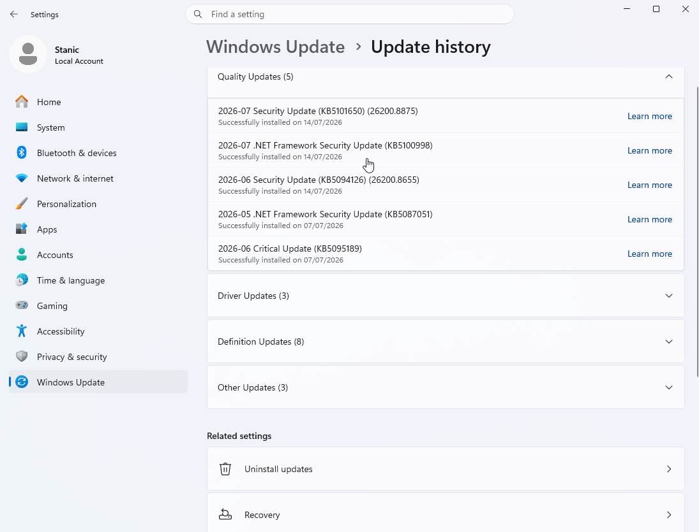
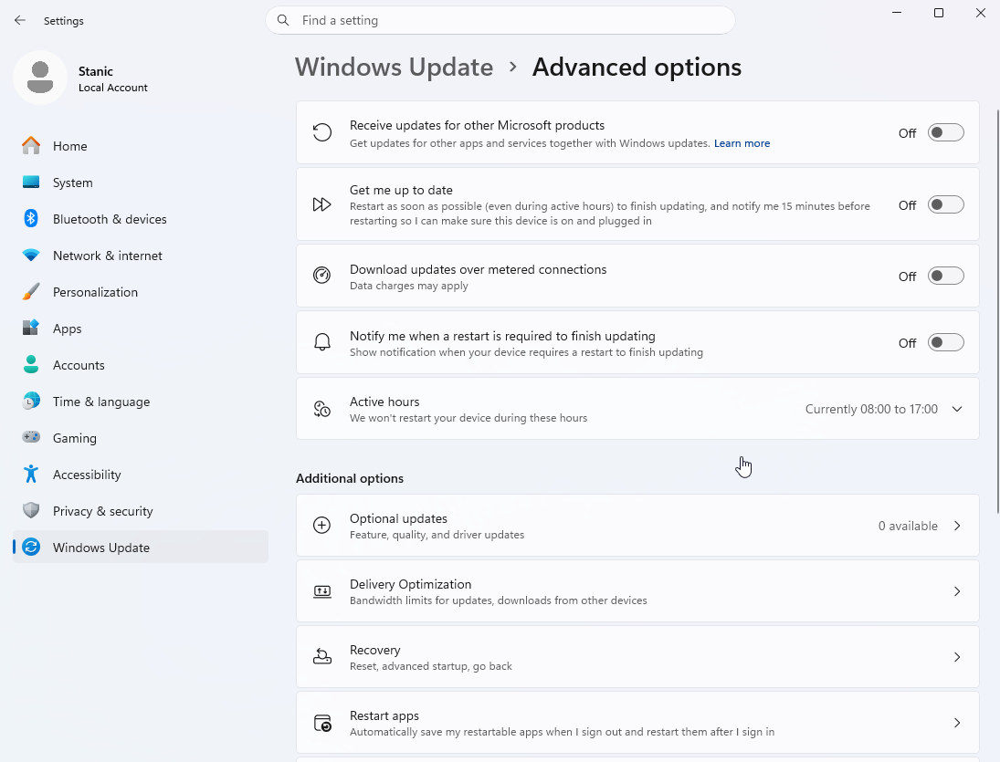

# System Maintenance

## Scenario

A local user account with standard privileges was required to practice software management and operating system maintenance. The goal was to install and uninstall an application, check for, install, and uninstall a Windows update, verify the administrator authorization required for those actions through User Account Control (UAC), and review the update history and advanced options.

## Environment

- **Operating system:** Windows 11 Enterprise Evaluation
- **Local user account:** `Alex`
- **Administrator account:** `Stanic`
- **Test application:** Google Chrome
- **Administration tools:** Windows Settings and Control Panel

## Skills Demonstrated

- Standard user privilege testing
- Software installation and uninstallation
- User Account Control (UAC)
- Windows Update management
- Update history review
- Advanced update option review

## Implementation

### 1. Created a standard local user account

A local user account named `Alex` was created with standard access. This provided a non-administrative environment for verifying how Windows handles software changes that require elevated privileges.

### 2. Installed and verified Google Chrome

While signed in as `Alex`, the Google Chrome installer was opened. Because `Alex` did not have administrator privileges, User Account Control required credentials for `Stanic`, the existing administrator account, before the installation could continue.

After authorization was provided, Google Chrome was installed and opened to verify that the application was operational.

### 3. Uninstalled and verified the removal of Google Chrome

Google Chrome was selected in **Programs and Features** within Control Panel, and the uninstall process was started.

Because removing the application required elevated privileges, User Account Control again requested credentials for the `Stanic` administrator account.

After the process was completed, Google Chrome no longer appeared in the installed programs list, confirming that the application had been removed.

### 4. Checked for Windows updates

Windows Update was opened while signed in to the `Stanic` administrator account. After checking for available updates, Windows reported that the system was up to date.

### 5. Reviewed the update history

The update history was reviewed to verify that recent quality updates had been installed. The history included security, .NET Framework, driver, definition, and other updates.

### 6. Reviewed advanced update options

The advanced options were reviewed to identify settings for Microsoft product updates, restart behavior, metered connections, update notifications, active hours, optional updates, and Delivery Optimization.

## Result

Google Chrome was installed and removed while signed in to the standard local account `Alex`. User Account Control required credentials for the `Stanic` administrator account before both changes could continue, confirming that `Alex` could not perform them with standard privileges.

Windows Update was then checked, and the system reported that it was up to date. The update history and advanced options were also reviewed, completing the software management and update maintenance tasks.

[← Return to Windows](../)