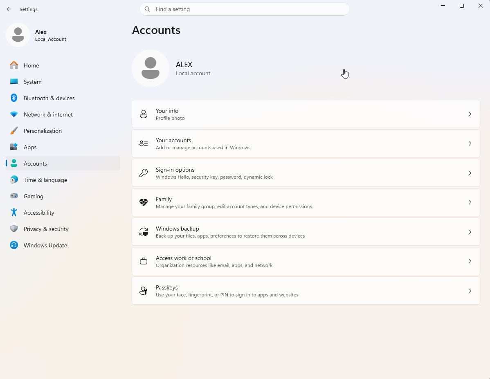
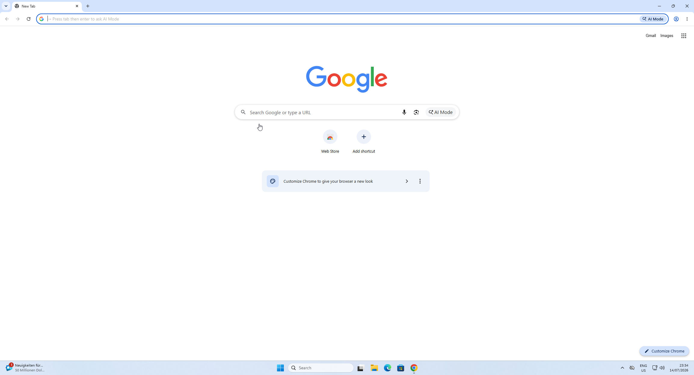
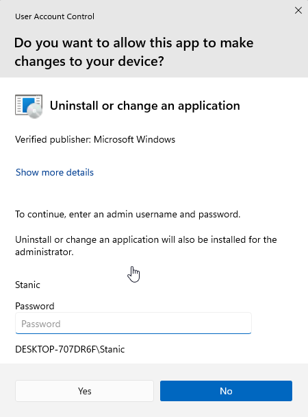
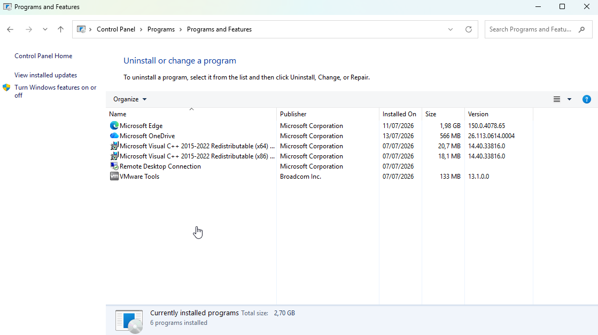
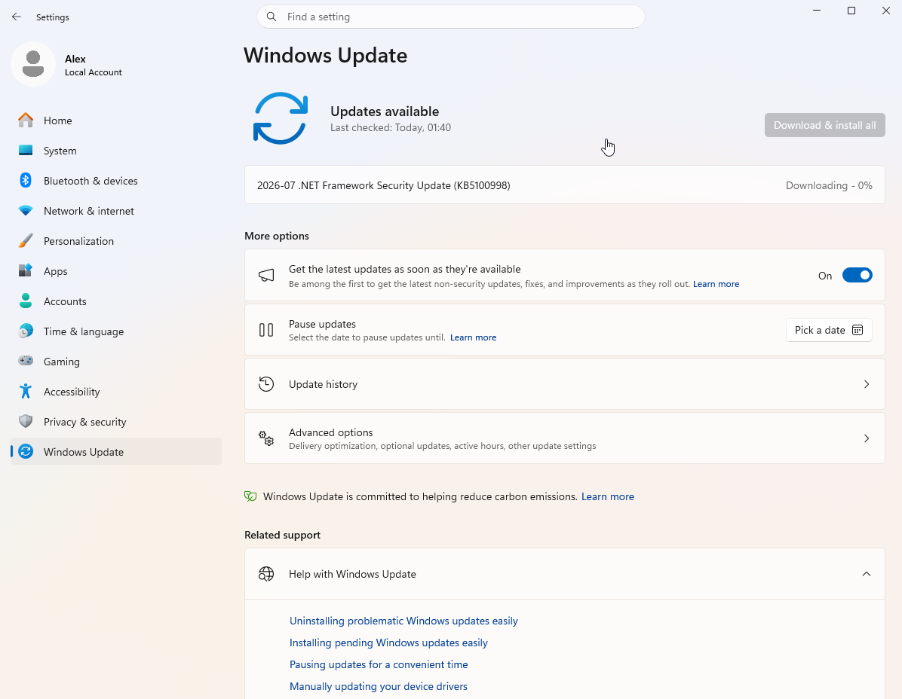
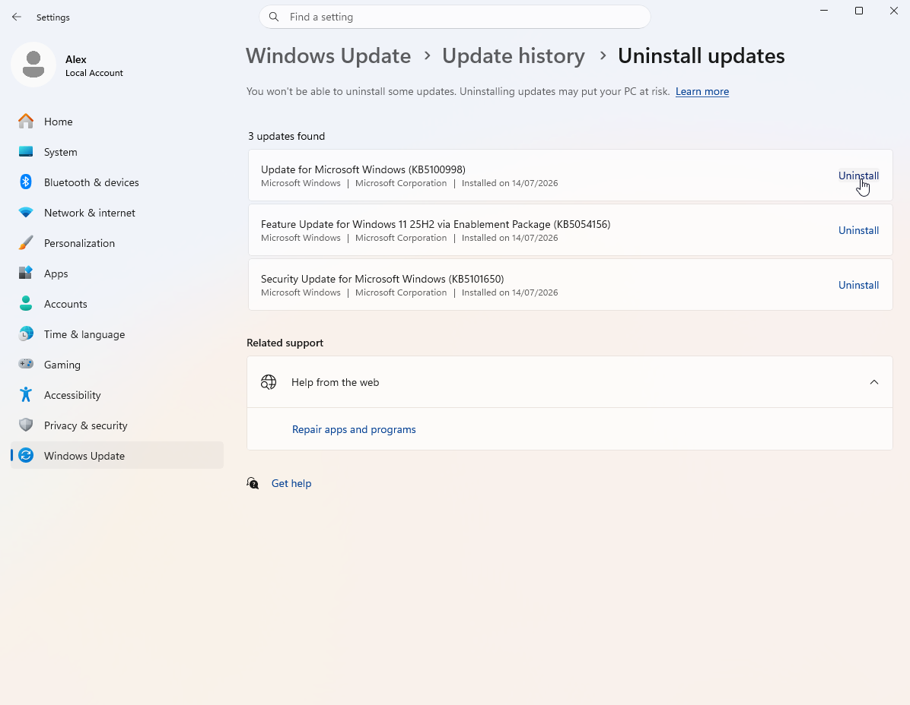
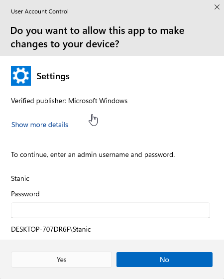

# System Maintenance

## Scenario

A local user account with standard privileges was required to practice software management and operating system maintenance. The goal was to install and uninstall an application, check for, install, and uninstall a Windows update, verify when administrator authorization was required through User Account Control (UAC), and review the update history and advanced options.

## Environment

- **Operating system:** Windows 11 Enterprise Evaluation
- **Local user account:** `Alex`
- **Administrator account:** `Stanic`
- **Test application:** Google Chrome
- **Administration tools:** Windows Settings and Control Panel

## Skills Demonstrated

- Standard user privilege testing
- Software installation and uninstallation
- User Account Control (UAC)
- Windows Update management
- Update history and advanced options review

## Implementation

### 1. Created a local user account with standard privileges

A local user account named `Alex` was created with standard privileges. This provided a way to verify which tasks required administrator authorization.

### 2. Installed and verified Google Chrome

While signed in to `Alex`, the Google Chrome installer was opened. Since the installation required elevated privileges, User Account Control requested an administrator username and password. Credentials for `Stanic`, the existing administrator account, were used to continue.

After authorization was provided, Google Chrome was installed and opened to verify that the application was operational.

### 3. Uninstalled and verified the removal of Google Chrome

Google Chrome was selected in **Programs and Features** within Control Panel to start the uninstallation process.

User Account Control once again requested credentials for the `Stanic` administrator account before the application could be removed.

After administrator credentials were provided and the uninstallation was completed, Google Chrome no longer appeared in the installed programs list, confirming that the application had been removed.

### 4. Checked for and installed a Windows update

While signed in to `Alex`, Windows Update was checked for available updates. A .NET Framework security update, `KB5100998`, was found, downloaded, and installed without requesting administrator authorization.

### 5. Uninstalled and verified the removal of a Windows update

After the update was installed, `KB5100998` appeared in the list of uninstallable updates and was selected for uninstallation.

Windows updates are commonly identified by a Knowledge Base (KB) number. This identifier can be searched online to locate the corresponding Microsoft documentation and review details about the update, including fixes, security changes, and known issues.

Because removing the update required elevated privileges, User Account Control requested credentials for the `Stanic` administrator account before the process could continue.

After the uninstallation was completed, `KB5100998` no longer appeared in the list of uninstallable updates, confirming that it had been removed.

### 6. Reviewed advanced Windows Update options

The **Advanced options** page was reviewed to become familiar with settings for restart behavior, metered connections, notifications, active hours, optional updates, and Delivery Optimization.

## Result

Google Chrome was installed and removed while signed in to the local account `Alex`. User Account Control required credentials for the `Stanic` administrator account before both actions could continue.

Windows update KB5100998 was downloaded and installed while signed in to `Alex` without administrator authorization. Removing the same update required administrator authorization through UAC, and its removal was verified. 
[← Return to Windows](../)