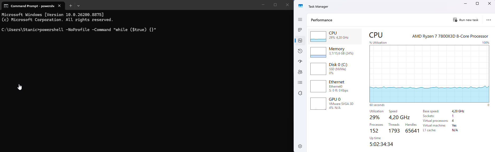
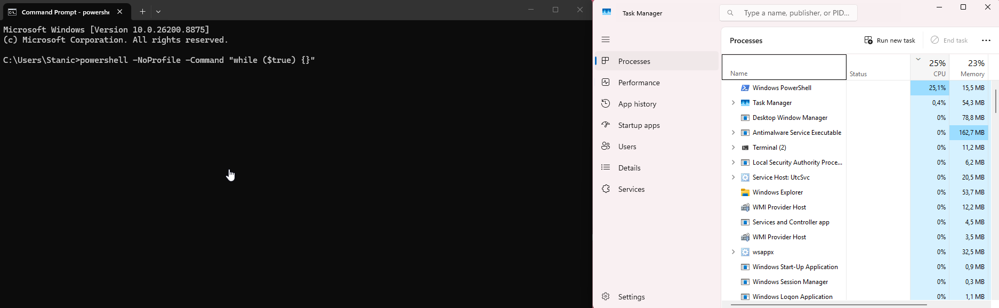
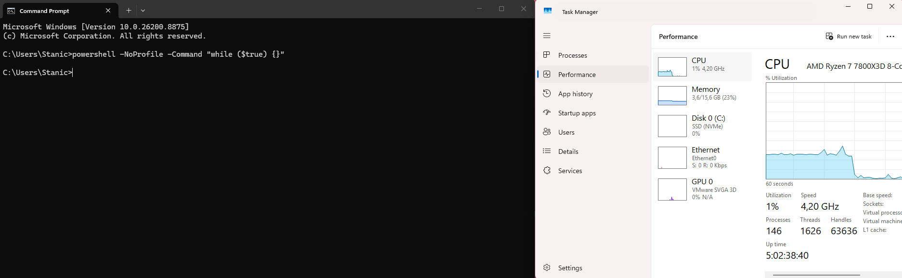
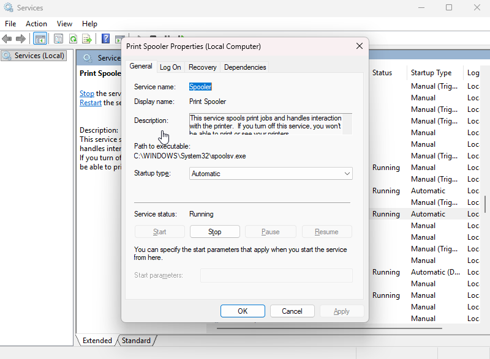
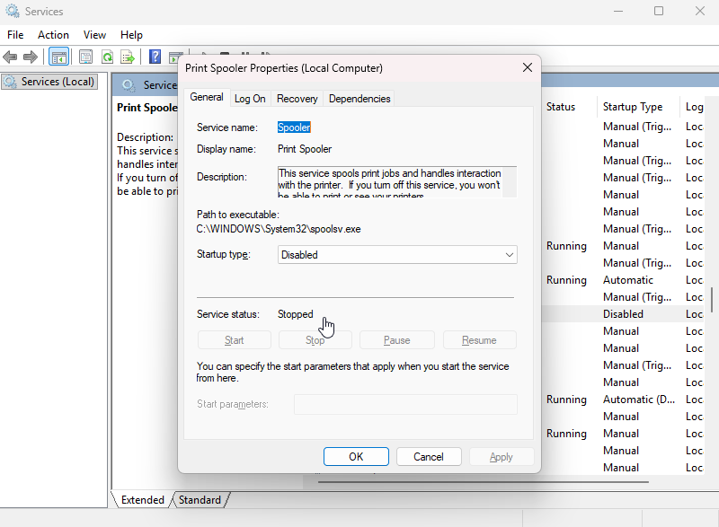
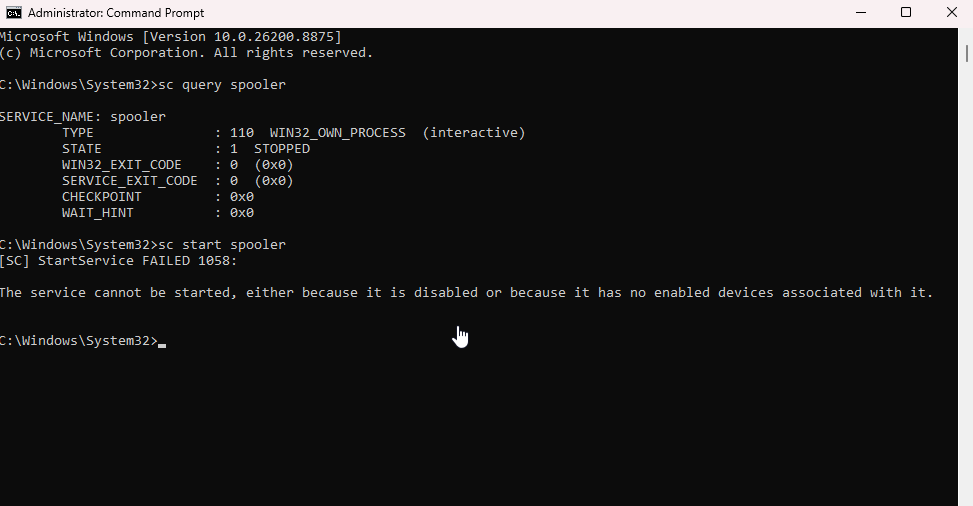
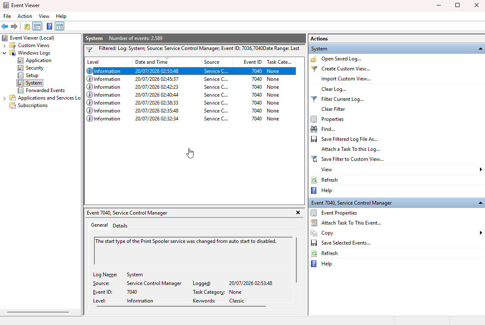
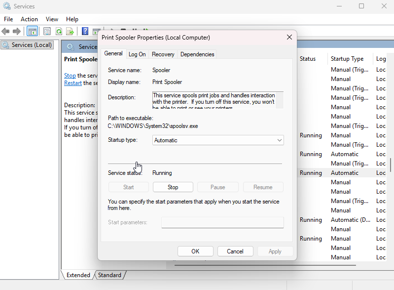
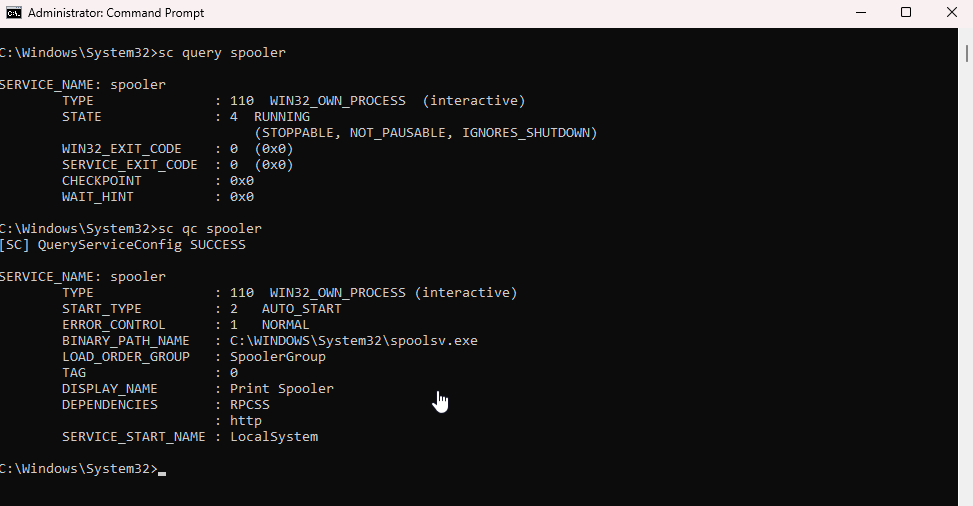

# Windows Process & Service Diagnostics

## Scenario

A Windows 11 VM was used to practice process monitoring and service troubleshooting by simulating high CPU usage and a Windows service failure. The goal was to create temporary high CPU usage, identify and end the responsible process, stop and disable the Print Spooler service, investigate the failure through Command Prompt and Event Viewer, restore the service, and verify normal operation.

## Environment

- **Operating system:** Windows 11 Enterprise Evaluation
- **Local administrator account:** `Stanic`
- **Administration tools:** Task Manager, Services, Command Prompt, and Event Viewer

## Skills Demonstrated

- PowerShell and Command Prompt usage
- Task Manager performance monitoring and process termination
- Windows service management
- Windows event log filtering

## Implementation

### 1. Generated high CPU usage

The following PowerShell command was run from Command Prompt to create temporary high CPU activity:

```cmd
powershell -NoProfile -Command "while ($true) {}"
```

Task Manager showed that CPU usage increased from the `0–3%` idle baseline to approximately `29%`.



### 2. Identified the high-CPU process

With the PowerShell command still running, the Processes tab in Task Manager was sorted by CPU usage. Windows PowerShell appeared at the top of the list, identifying it as the process responsible for the increase.



### 3. Ended the process and verified CPU recovery

The Windows PowerShell process was ended through Task Manager. CPU usage dropped to `1%`, confirming that it had returned to the normal idle range.



### 4. Reviewed the Print Spooler configuration

The second part of the lab focused on Windows service troubleshooting. The Print Spooler properties were reviewed before making any changes. The service was running, and its startup type was set to `Automatic`.



### 5. Stopped and disabled the Print Spooler service

The Print Spooler service was stopped, and its startup type was changed from `Automatic` to `Disabled`.



### 6. Verified the service failure through Command Prompt

Command Prompt was opened as an administrator, and the following command was run to check the service:

```cmd
sc query spooler
```

The output showed that the service was stopped. An attempt was then made to start it:

```cmd
sc start spooler
```

Windows returned error `1058` because the service was disabled.



### 7. Reviewed the related event

The System log in Event Viewer was filtered for Service Control Manager events. Event ID `7040` showed that the Print Spooler startup type had changed from automatic to disabled.



### 8. Restored the Print Spooler service

The Print Spooler startup type was changed back to `Automatic`, and the service was started.



### 9. Verified the service configuration

As a final check, the following commands were run:

```cmd
sc query spooler
sc qc spooler
```

The output confirmed that the service was running and configured to start automatically.



## Result

The high CPU usage was traced to the Windows PowerShell process through Task Manager. Ending the process reduced CPU usage from approximately `29%` to `1%`.

The Print Spooler was stopped and disabled, and the startup failure was investigated through Services, Command Prompt, and Event Viewer. The service was then restored to its original `Automatic` startup type, and its running state was verified through Command Prompt.

[← Return to Windows](../)